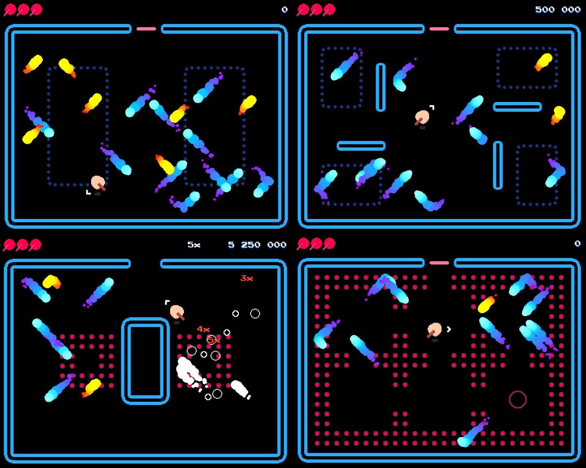

# Deflector

Deflector is a game made in the Unity engine. The full source code is open source under an MIT license and available for anyone to look at, modify and include in other games. Artworks, music and sound effects are copyright protected with all rights reserved. 

Download a playable build from [Deflector’s Itch.io page](https://mandarin.itch.io/deflector).

Check out the trailer on [YouTube](https://www.youtube.com/watch?v=dBHhqP7QriI).

## Author
Concept, design, animation and programming done by Thomas Viktil. [Follow me on Twitter](https://twitter.com/mandarinx) for tweets about programming and game development.

Deflector was originally a response to a challenge. Could I make a playable video game in a week? To make the challenge a bit more interesting, I was also working full time and starting a family. My son was at that time 8 months old.

As the only spare time I had was the morning hours before starting the work day, I had to leave for the office at about 5:15 am. It took me 10 hours to make a playable version. Tight restrictions are good for productivity! The reception was good enought to give me the motivation I needed to continue working on Deflector.

I made it a goal to not stop until I could release Deflector, no matter how good or bad I thought it was. It became a test of stamina and discipline. In order to release Deflector while I'm still alive, I had to loosen my requirements for technical standard, not think about performance issues and accept that not every part of the game will be perfect.

After 9 months of work, I'm more pleased with Deflector than I thought I would be.

I have written as much documentation as I think is necessary to understand the source code. Most of it is, in my opinion, fairly simple and straight forward, and shouldn’t be hard to understand.

I have made a note to properly describe how I resolve collisions between the player and the environment, and why I did it like this. Without a good understanding of how PhysX resolves collisions, the solution might not seem obvious.

## Collaborators

Dan Wakefield made all of the sound effects and the music tracks. He did a fantastic job, and gave way more than I had expected to get for such a project. The last couple of months have been a lot easier due to his support and encouragements. Thanks for all the talks, your honest feedback, dedication to doing a good job and moral support.

Pete Ellison did the logo. Thank you for doing a great job, and the good conversations we had over email.

## Downloads
You can download the latest builds from the [Itch.io page](https://mandarin.itch.io/deflector).

## Contributions
I’d be happy to accept pull requests. You can also fork the project and do whatever you want with it. Please let me know if you make anything out of this. I’d love to see it!

## Known issues
- When a level set has only one level, it won't properly reset when you play it the second time.

## Contents
- [General](#general)
- [Architecture](#architecture)
- [Events](#events)
- [Tilemap](#tilemap)
- [Custom assets](#customassets)
- [Pixel art camera](#pixelartcamera)

# General
Add a new game view size to the dropdown in the Game view. Set it to 360 x 288 pixels to match the game.

# Architecture
I chose an event driven architecture, where most of the components communicates via events as ScriptableObjects and UnityEvents for event handlers. As much of the data as possible was separated from the MonoBehaviours and put in ScriptableObjects. 

The idea of using ScriptableObjects for events was taken from [Ryan Hipple’s talk at the Unite Austin 2017 conference](https://www.youtube.com/watch?v=raQ3iHhE_Kk).

A reason for separating data from code is to make it easier to change data without causing too many changes in the source files. When you change a field of a MonoBehaviour, the entire scene file is marked as changed. Committing scene files is an almost guaranteed way of causing merge conflicts.

Another reason for keeping data in ScriptableObjects is to be able to edit values in play mode without loosing them when reentering edit mode. ScriptableObjects live outside the scene and are not affected by the switch between play and edit mode.

Behaviours are separated into many smaller components that does one or a few things. More complex behaviours are composed of several components. An advantage of such an architecture is that you don't have to create many components before you can start to create more complex behaviours. It becomes easier to reuse code just by putting the components in new contexts. While this architecture is known to work well, it became a big mess when I used ScriptableObjects to handle the communication between the components.

The idea of events as ScriptableObjects sounds very exciting when you see Ryan's talk. I think Ryan could have talked a bit more about how they manage such a decoupled asset based architecture at Schell Games. Concepts like this are never all sunshine and no clouds. The absolute hardest part about managing this setup is visualizing the code flow. You have to keep track of the objects in hierarchy, prefabs and ScriptableObjects in project view. Without any tools for helping you, you'll be clicking all over your project.

I created an inspector for some of the events to show which components dispatches the event, and which listens for it. It's not perfect because it doesn't search the project view for any prefab that might dispatch or listen for the event. A tool like that can work fine in a small game like this, but it will be slower the more files you have, so it'll never be optimal.

With this project I learnt that ScriptableObjects as events can have a useful role in a game project, but not for any kind of event. There should be a distinction between system events and game play events. System events are critical for the game to work, and game play events are non-critical events like telling the audio system to play a sound.

## Advantages to the architecture
### Composition over inheritance
By using composition instead of inheritance, you end up creating a library of many smaller components that do one or a few things. It’s very easy to find bugs when the classes are less than a hundred lines. It can also speed up the development since you don’t have to compile the project for every change. You simply drag and drop all the components you need, and do the plumbing via Unity’s Inspector instead of in code.

### Reusable components
Generic components are free of context. A component for tinting a sprite’s color can be used in many different contexts, but the act of changing the color is still the same. These components are easier to reuse, both within the project and across multiple projects. 

### Flexibility
A library of generic components with a well designed API, makes for a very flexible system. This is very good for prototyping and the first phase of development. 

### Data in ScriptableObjects
ScriptableObjects live outside the scene. Any changes you make to a ScriptableObject while in play mode, gets serialized to disk and not lost when you reenter edit mote. Due to living outside the scene, they make it a lot easier to work in a multi scene setup. You can rely on ScriptableObjects for inter-scene communication. Unity won’t allow you to make a reference between two GameObjects in two different scenes. So, you can use a ScriptableObject as a middle man. This goes for any other Unity asset that doesn’t live in the scene, like an Animator or a Timeline asset.

## Disadvantages to the architecture
### Hard to get an overview
Your GameObjects will often end up with lots and lots of components, and they will all be referencing each other via UnityEvents. When they also communicate with other GameObjects via ScriptableObjects, it tends to be quite hard to really see what’s going on. Fixing bugs within a component is easier, but finding bugs in the plumbing is very hard. You need to good editor tools to help you visualize the code flow from component to component.

### Temporarily increasing complexity
As you create more and more complex behaviors by composing lots of little components, you add complexity to the project. At some point it becomes hard to work with, and that’s when you should consider collapsing many generic components into a one or a few more game specific components. This is a disadvantage because you have to spend time making those game specific components. That work won’t take you any further towards your goal. In addition you are adding new code to the project, and therefore new bugs. There’s a technical debt building up as the complexity of your setup increases.

### Generic callbacks
Due to the generic nature of the components, they will never output any of the custom data types you have created for your project. You’ll find that in some cases you would like a component to output a specific value. Instead you get something like a GameObject or a Transform, and therefore have to use GetComponent to get what you want. Sometimes you need to call GetComponent in multiple places within the same frame, which is a waste of CPU time. It might not be much, but it’s still unnecessary.

# Events
Ryan Hipple gave a very good explanation of the event system in [his talk](https://www.youtube.com/watch?v=raQ3iHhE_Kk).

I have used this system in two different projects, and have seen some of it’s strengths and weaknesses. As Ryan demonstrates in his talk, one of the strengths is how easy it is for a game designer to create behaviors simply via drag and drop. I experienced that the first phase of a project went really fast. I had things up and running in no time. As mentioned in the chapter on architecture, the complexity increases rapidly along with the technical debt.

In both projects where I used this technique, I went all in and used it everywhere. In hindsight, that wasn’t such a good idea. At least I got to really try the concept. For a future project I would create a more clear separation of system code and gameplay code, and expose certain ScriptableObject events to the game designer. By exposing all events, you create a lot of clutter. It makes it too easy for a game designer to hook up with the wrong events.

Although I consider Deflector to be a simple game, this kind of architecture resulted in a surprisingly complex setup.

# Tilemap
The brushes used were originally taken from the [RoboDash repo](https://github.com/Unity-Technologies/2d-gamedemo-robodash) and some code from the [2d-extras repo](https://github.com/Unity-Technologies/2d-extras). I found the RoboDash code quite messy, and cleaned it up and fixed a few bugs.

# Custom assets
Building on the thought of putting all data in ScriptableObjects, I put data like player health, multiplier and score value in each their own ScriptableObject. Using the observer concept, I made them so that one can subscribe to changes in the values. This made setting up UI a lot more easier. The component responsible for changing the value of a ScriptableObject won’t have to know about the UI at all. It simply sets the value. The asset provides the functionality to let any subscribers be notified of changes.

I haven’t found any disadvantages to putting data in ScriptableObjects. If I have to pick one, it’s that organizing all of the assets becomes a little challenge. It’s certainly not unsolvable if you use good naming conventions and folders. I think organization wise, it would be more clear if one could group these assets into a parent asset. So, health, score and multiplier are added as sub assets to a parent asset. That way, you could also instantiate a new copy of the parent asset for player number two. I haven’t thought out all the details, so I’m not completely sure if this is a good idea.

# Pixel art camera
Pixel art cameras are a much debated topic among developers. There seem to be as many solutions as there are developers. I researched the subject to get familiar with the problem a pixel art camera tries to solve. I tried many different solutions, but only the free ones. I was of the opinion that a pixel art camera solves a rather simple problem, and I wasn’t willing to spend money on it.

Deflector uses a simple setup with a single screen per level. The camera never moves, and the size of the levels are always the same. It was important for this camera to maintain the correct aspect ratio of the scene, no matter what aspect ratio the monitor has. I opted for an old school solution of adding black borders around the scene when the monitor’s aspect ratio is different from the scene’s.

The math involved in figuring out what size to render the game in, is rather simple. The camera blits the scene to a RenderTexture, and passes it on to screen buffer via a specific material. The material uses a shader which positions the RenderTexture at the center of the screen and fills the borders with the camera’s background color.

## License

All source code is licensed under the MIT License.

All artworks and audio is copyright protected. All rights reserved.

### MIT License

Copyright (c) 2017 Thomas Viktil

Permission is hereby granted, free of charge, to any person obtaining a copy
of this software and associated documentation files (the "Software"), to deal
in the Software without restriction, including without limitation the rights
to use, copy, modify, merge, publish, distribute, sublicense, and/or sell
copies of the Software, and to permit persons to whom the Software is
furnished to do so, subject to the following conditions:

The above copyright notice and this permission notice shall be included in all
copies or substantial portions of the Software.

THE SOFTWARE IS PROVIDED "AS IS", WITHOUT WARRANTY OF ANY KIND, EXPRESS OR
IMPLIED, INCLUDING BUT NOT LIMITED TO THE WARRANTIES OF MERCHANTABILITY,
FITNESS FOR A PARTICULAR PURPOSE AND NONINFRINGEMENT. IN NO EVENT SHALL THE
AUTHORS OR COPYRIGHT HOLDERS BE LIABLE FOR ANY CLAIM, DAMAGES OR OTHER
LIABILITY, WHETHER IN AN ACTION OF CONTRACT, TORT OR OTHERWISE, ARISING FROM,
OUT OF OR IN CONNECTION WITH THE SOFTWARE OR THE USE OR OTHER DEALINGS IN THE
SOFTWARE.
